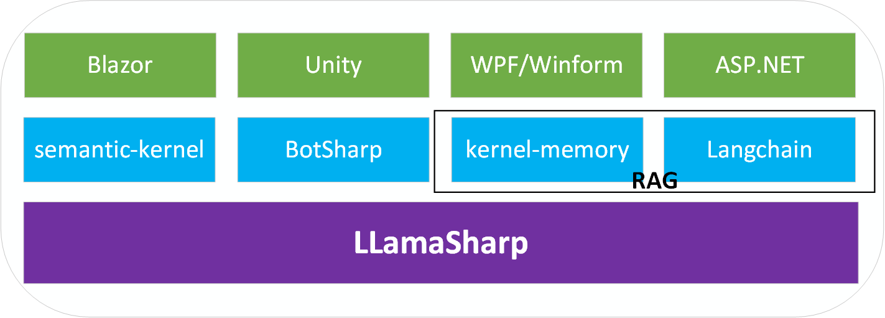

# Overview

LLamaSharp is a cross-platform library to run 🦙LLaMA/LLaVA model (and others) in local device. Based on [llama.cpp](https://github.com/ggerganov/llama.cpp), inference with LLamaSharp is efficient on both CPU and GPU. With the higher-level APIs and RAG support, it's convenient to deploy LLM (Large Language Model) in your application with LLamaSharp.

## Essential insights for novice learners

If you are new to LLM, here're some tips for you to help you to get start with `LLamaSharp`. If you are experienced in this field, we'd still recommend you to take a few minutes to read it because some things perform differently compared to cpp/python.

1. The main ability of LLamaSharp is to provide an efficient way to run inference of LLM on your device (and fine-tune model in the future). The model weights, however, need to be downloaded from other resources such as [huggingface](https://huggingface.co).
2. To gain high performance, LLamaSharp interacts with a native library compiled from c++, which is called `backend`. We provide backend packages for Windows, Linux and MAC with CPU, Cuda, Metal and OpenCL. You **don't** need to handle anything about c++ but just install the backend packages. If no published backend match your device, please open an issue to let us know. If compiling c++ code is not difficult for you, you could also follow [this guide]() to compile a backend and run LLamaSharp with it.
3. `LLaMA` originally refers to the weights released by Meta (Facebook Research). After that, many models are fine-tuned based on it, such as `Vicuna`, `GPT4All`, and `Pyglion`. There are two popular file format of these model now, which are PyTorch format (.pth) and Huggingface format (.bin). LLamaSharp uses `GGUF` format file, which could be converted from these two formats. There are two options for you to get GGUF format file. a) Search model name + 'gguf' in [Huggingface](https://huggingface.co), you will find lots of model files that have already been converted to GGUF format. Please take care of the publishing time of them because some old ones could only work with old version of LLamaSharp. b) Convert PyTorch or Huggingface format to GGUF format yourself. Please follow the instructions of [this part of llama.cpp readme](https://github.com/ggerganov/llama.cpp?tab=readme-ov-file#prepare-and-quantize) to convert them with the python scripts.
4. LLamaSharp supports multi-modal, which means that the model could take both text and image as input. Note that there are two model files requied for using multi-modal (LLaVA), which are main model and mm-proj model. Here is a huggingface repo which shows that: [link](https://huggingface.co/ShadowBeast/llava-v1.6-mistral-7b-Q5_K_S-GGUF/tree/main).

## Integrations

There are integarions for the following libraries, which help to expand the application of LLamaSharp. Integrations for semantic-kernel and kernel-memory are developed in LLamaSharp repository, while others are developed in their own repositories.

- [semantic-kernel](https://github.com/microsoft/semantic-kernel): an SDK that integrates LLM like OpenAI, Azure OpenAI, and Hugging Face.
- [kernel-memory](https://github.com/microsoft/kernel-memory): a multi-modal AI Service specialized in the efficient indexing of datasets through custom continuous data hybrid pipelines, with support for RAG ([Retrieval Augmented Generation](https://en.wikipedia.org/wiki/Prompt_engineering#Retrieval-augmented_generation)), synthetic memory, prompt engineering, and custom semantic memory processing.
- [BotSharp](https://github.com/SciSharp/BotSharp): an open source machine learning framework for AI Bot platform builder.
- [Langchain](https://github.com/tryAGI/LangChain): a framework for developing applications powered by language models.

## Welcome to join the development!

Community effort is always one of the most important things in open-source projects. Any contribution in any way is welcomed here. For example, the following things mean a lot for LLamaSharp:

1. Open an issue when you find something wrong.
2. Open an PR if you've fixed something. Even if just correcting a typo, it also makes great sense.
3. Help to optimize the documentation. 
4. Write an example or blog about how to integrate LLamaSharp with your APPs.
5. Ask for a missing feature and discuss with us.

If you'd like to get deeply involved in development, please touch us in discord channel or send email to `AsakusaRinne@gmail.com`. 🤗
